# UAS Bahasa Pemrograman Semester 1

Nama : Bangkit Akbar Anggara 
NIM : 312010148 
Kelas : TI.20.B.1 

# Soal
Berikut ini adalah soal Ujian Akhir Semester(UAS) 1 yang diberikan oleh dosen saya 
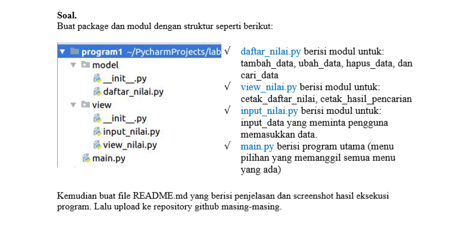 
Disitu tertulis kita disuruh membuat package dan modul lalu jelaskan di github berserta gambar screen shotnya 

# Penyelesaian
Oke Berikut adalah syntax - syntax yang saya gunakan untuk mengerjakan soal diatas 
1. Package modul(daftar_nilai) [Click Here](model/daftar_nilai.py)
2. Package view(input_nilai) [Click Here](view/input_nilai.py) dan view(view_nilai) [Click Here](view/view_nilai.py)
3. modul main [Click Here](main.py)

Setelah kalian melihat syntax diatas saya akan menjelaskannya satu - persatu: 
1. Daftar_Nilai 
  - Dictionary 
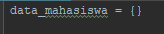 
Penjelasan: 
    - Disini kita menggunakan dictionary ya untuk menyimpan inputan data mahasiswa 
  
  - Def tambahkan 
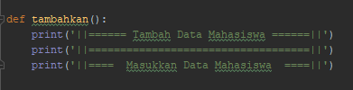 
Penjelasan: 
    - Dibagian ini kita gunakan print untuk penulisan bagian input data mahasiswa nanti agar terlihat rapih 
  
  - Def hapus 
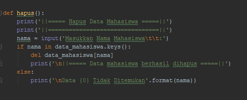 
Penjelasan: 
    - Disini kita buat inputan yang menginput nama 
    - Gunanya untuk menghapus data mahasiswa dari nama mahasiswa itu sendiri 
    - Kita gunakan del untuk fungsi menghapus datanya 
    - (If)Jika mahasiswa tersebut ada maka data mahasiswa tersebut akan terhapus 
    - (Else)Jika nama mahasiswa tersebut tidak ada maka datanya tidak akan ditemukan 
  
  - Def ubah 
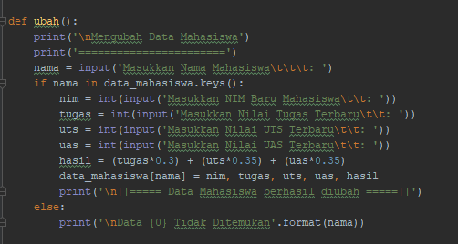 
Penjelasan: 
    - Disini kita hampir sama dengan yang hapus, kita gunakan inputan nama untuk mengubah NIM, Nilai Tugas, Ujian Tengah Semester(UTS), ataupun Ujian Akhir Semester(UAS) 
    - Lalu setelah kita memasukkan nama maka dictionary akan mengeksekusi program menggunakan keys untuk mencari data dari nama mahasiswa tersebut 
    - (If)Jika nama mahasiswa tersebut ketemu atau ada didalam data maka program akan masuk ke inputan NIM, Nilai Tugas, Nilai UTS, dan Nilai UAS yang baru 
    - (Else)Jika nama mahasiswa tersebut tidak ada didalam data maka program akan memunculkan tulisan atau perintah bahwa data mahasiswa tidak ada 

  - Def cari 
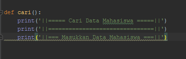 
Penjelasan: 
    - Fungsinya sama dengan tambahkan 
 
2. Input_Nilai 
  - From dan import 
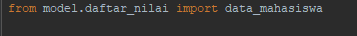 
Penjelasan: 
    - From digunakan untuk memanggil package sementara import untuk tujuan yang kita pilih yaitu modul daftar_nilai 
    - Lalu kita gunakan import data_mahasiswa itu gunanya agar saat kita menginputkan data atau setiap kali kita menambah data maka data mahasiswa secara otomatis akan masuk kedalam dictionary meskipun beda atau terpisah package dan juga modulnya 

  - Def tambah data 
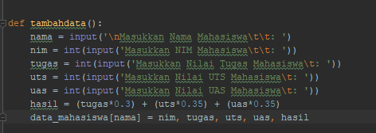 
Penjelasan: 
    - Disini kita buat inputan karena tadi kita sudah membuat kata - kata outputnya kali ini kita cukup membuat inputan data mahasiswanya saja 
    - Jangan lupa gunakan perkalian untuk menghitunghasil total atau rata- ratanya 

3. View_Nilai 
  - From dan import 
 
Penjelasan: 
    - Fungsinya sama saja dengan yang ada dibagian Input_Nilai 
 
  - Def tampil 
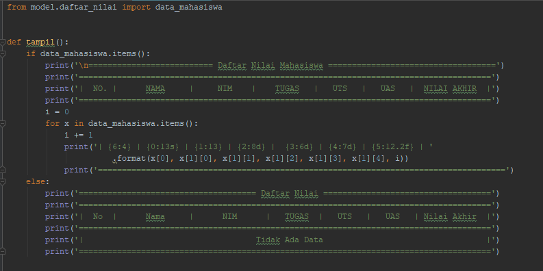 
Penjelasan: 
    - Disini kita buat sebuah tabel untuk menampilkan data - data dan nama - nama mahasiswa didalam dictionary 
    - (If)Jika terdapat data maka data dan nama mahasiswa tersebut akan muncul 
    - Disini kita menggunakan for untuk melakukan perulangan nomor urut 
    - (Else)Jika kita belum menginputkan data sama sekali maka akan muncul tulisan "tidak ada data" 
    
  - Def cari data 
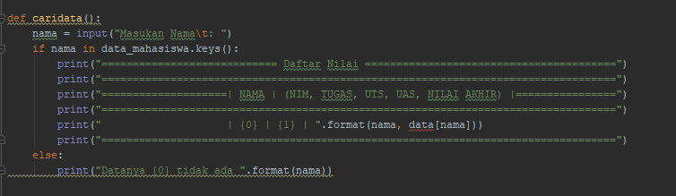 
Penjelasan: 
    - Tadi kita sudah buat print sama seperti dibagian Input_Nilai 
    - Kita akan langsung membuat inputan dengan format nama untuk mencari data dari mahasiswa yang sedang kita cari 
    - (If)Jika data mahasiswa yang dicari ada didalam dictionary maka data baik Nama, NIM, Nilai Tugas, Nilai UTS, dan Nilai UAS akan muncul 
    - (Else)Jika data mahasiswa yang dicari tidak ada didalam dictionary maka akan muncul tulisan "datanya tidak ada" 
 
4. Main 
  - From dan import 
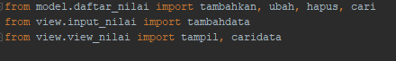 
Penjelasan: 
    - Sama seperti sebelumnya hanya saja disini sedikit berbeda 
    - From disini kita tulis package.modulnya lalu import fungsi(def) tadi 
    - Karena dibagian main ini kita akan menggunakan atau membuat syntax pilihan menu 
   
  - While True 
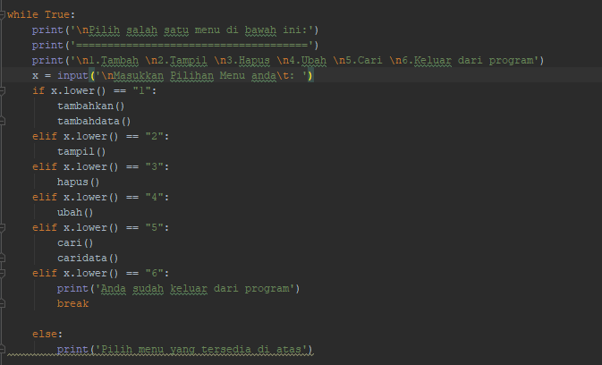 
Penjelasan: 
    - Kita gunakan print untuk membuat pilihan menunya 
    - Lalu kita buat inputan untuk memilih menu nanti ketika program dijalankan 
    - (If dan Elif)Kita gunakan karena kita akan membuat cabang pilihan yang banyak 
    - Lalu dibawahnya kita tambahkan  juga fungsi - fungsi yang sudah kita buat tadi 
    - Pada perintah ke 6 kita gunakan break untuk keluar dari program yang kita jalankan 
    - (Else)Jika kita tidak memilih salah satu menu tersebut maka akan muncul peringatan "pilih menu yang tersedia diatas" 
    
Setelah semmuanya selesai maka kita akan menjalankan/run syntax untuk mengerun atau menjalankan syntax harus yang main karena pilihan menunya ada di main
Berikut adalah tampilan dari program atau syntax- syntax yang sudah kita buat tadi 

1. Tambah data mahasiswa 
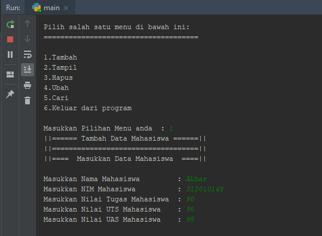 
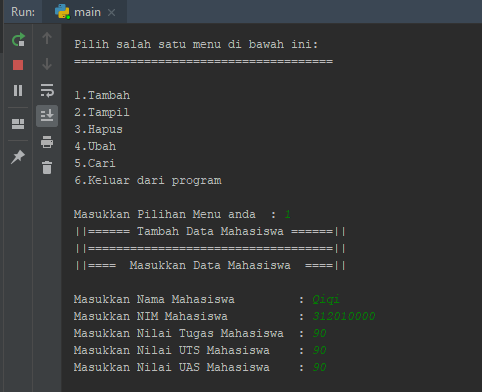 

2. Tampilkan data mahasiswa 
Jika kita sudah memasukkan atau menginputkan data mahasiswa 
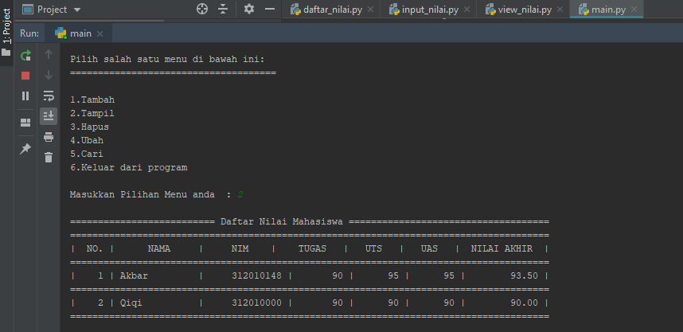 
Jika kita belum menginputkan data mahasiswa 
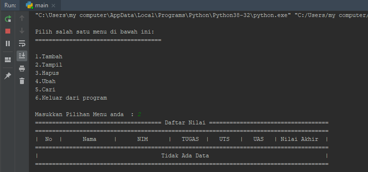 

3. Menghapus data mahasiswa 
Jika kita sudah memasukkan atau menginputkan data mahasiswa 
!hapus_data_qiqi.png](Pic/hapus_data_qiqi.png) 
Jika kita belum menginputkan data mahasiswa 
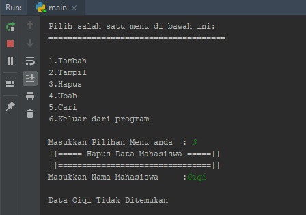 
Tampilan data jika kita sudah berhasil menghapus data mahasiswa 
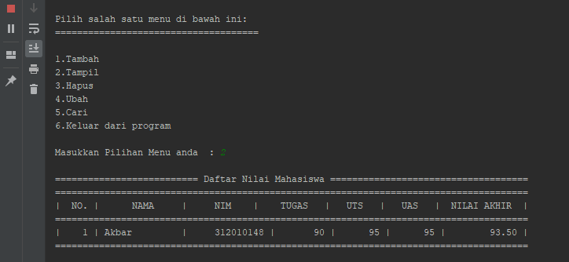

4. Mengubah data mahasiswa 
Jika kita sudah memasukkan atau menginputkan data mahasiswa 
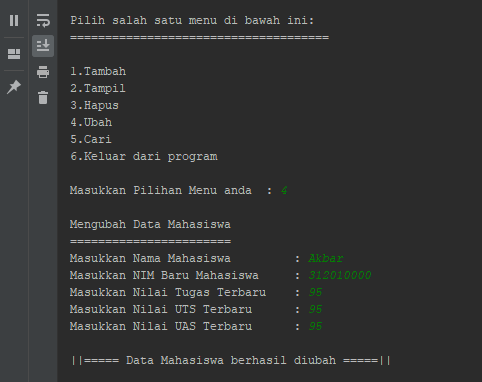 
Jika kita belum menginputkan data mahasiswa 
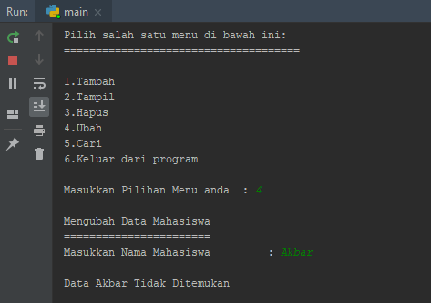 
Tampilan data jika kita sudah berhasil mengubah data mahasiswa 
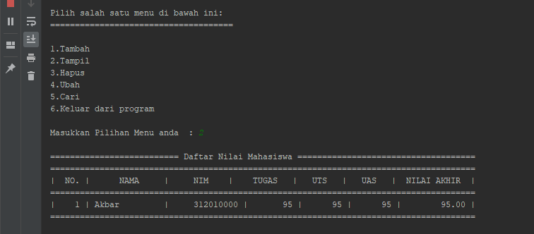

5. Mencari data mahasiswa 
Jika kita sudah memasukkan atau menginputkan data mahasiswa 
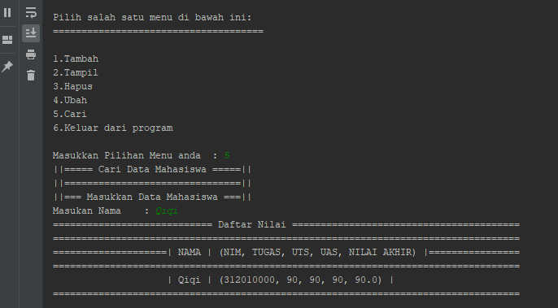 
Jika kita belum menginputkan data mahasiswa 
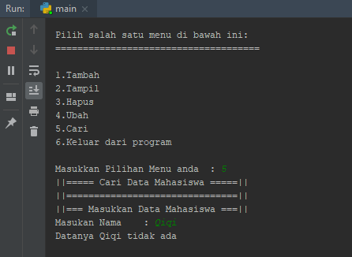 

6. Kelar dari program 
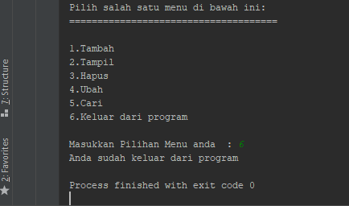 

7. Pilih menu yang tersedia diatas 
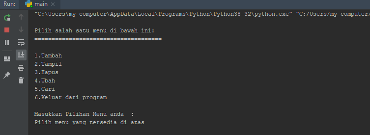

Oke sekian penjelasan dan selesai sudah tugas Ujian Akhir Semester(UAS) 1 untuk Mata Kuliah Bahasa Pemrograman 
Sekian Terimakasih Banyak 

||==== Bangkit Akbar Anggara ====||
||==== TI.20.B.1 ====||
||==== 312010148 ====||
